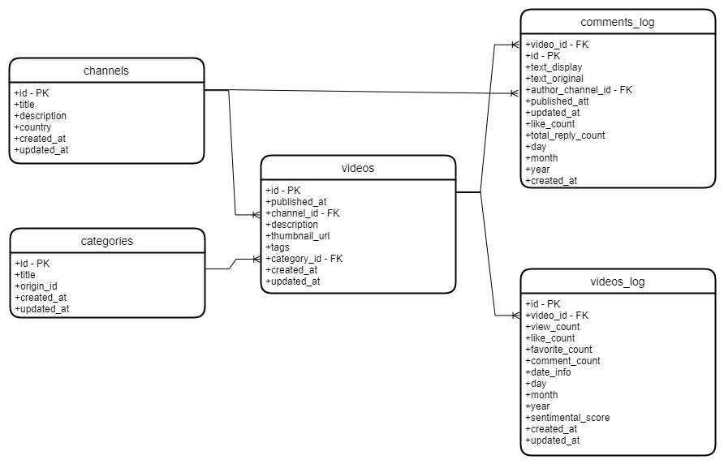

# Ü-Feeling

## Overview

Ü-Feeling is a web app that will pull data from YouTube's API, and generate sentiment analysis based on the comments in this platform.

# Short-term usability goals

- Analyze the sentiment of the YouTube users
- Pull data from Youtube API, and take advantage of it
- Display daily information about the comments on the videos

# Long-term usability goals

- Create a flexible tool where you can create your own metrics inside the web app, and upload your own inputs.

# Database tables

## Entities

In this case we are planning to have 5 entities:

- categories: All the categories that exist in youtube
- videos: Record of all the videos that have been requested in the app
- videos_log: Daily record about information and some statistics of all the videos that have been requested in the app
- comments: Daily record about information and some statistics of all the comments from the videos that have been requested in the app
- authors: Information about the authors from the videos that have been requested in the app

## Entity-Relationship Diagram

Prueba
